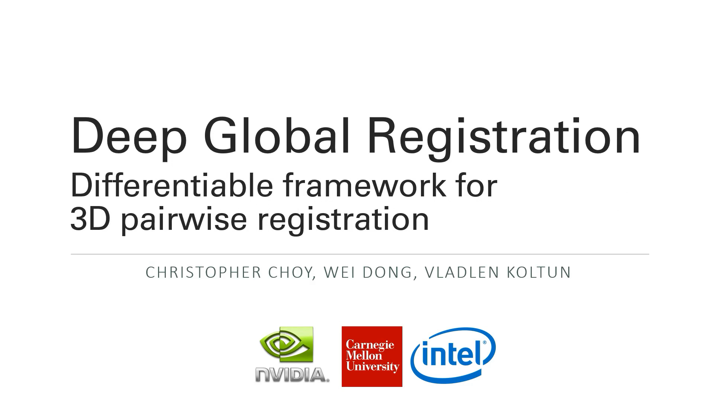
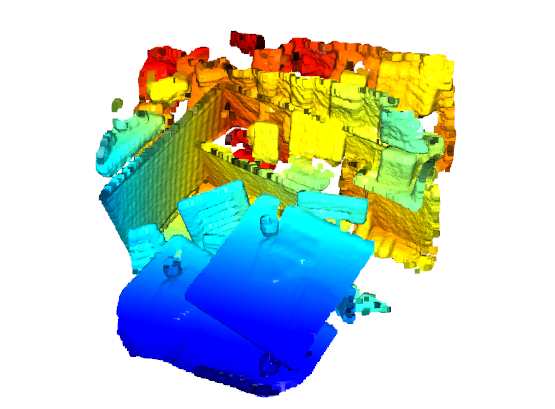
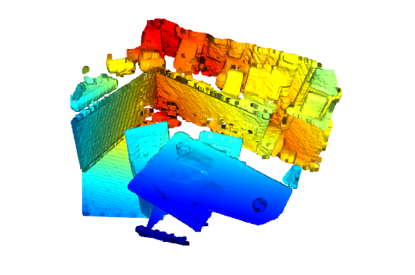
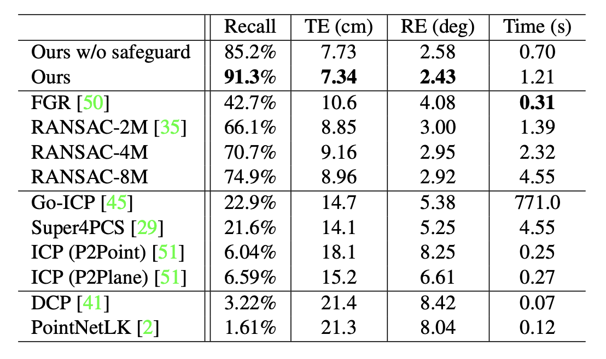
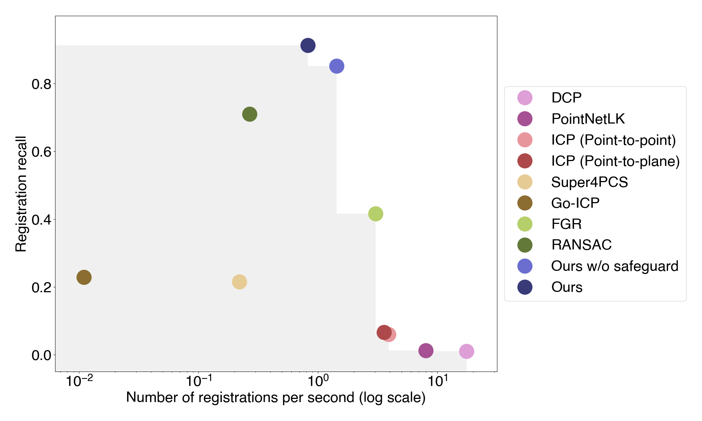

# Deep Global Registration

## Introduction
This repository contains python scripts for training and testing [Deep Global Registration, CVPR 2020 Oral](https://node1.chrischoy.org/data/publications/dgr/DGR.pdf).
Deep Global Registration (DGR) proposes a differentiable framework for pairwise registration of real-world 3D scans. DGR consists of the following three modules:

- a 6-dimensional convolutional network for correspondence confidence prediction
- a differentiable Weighted Procrustes algorithm for closed-form pose estimation
- a robust gradient-based SE(3) optimizer for pose refinement. 

For more details, please check out

- [CVPR 2020 oral paper](https://node1.chrischoy.org/data/publications/dgr/DGR.pdf)
- [1min oral video](https://youtu.be/stzgn6DkozA)
- [Full CVPR oral presentation](https://youtu.be/Iy17wvo07BU)

[](https://youtu.be/stzgn6DkozA)


## Quick Pipleine Visualization
| Indoor 3DMatch Registration | Outdoor KITTI Lidar Registration |
|:---------------------------:|:---------------------------:|
|  |  |

## Related Works
Recent end-to-end frameworks combine feature learning and pose optimization. PointNetLK combines PointNet global features with an iterative pose optimization method. Wang et al. in Deep Closest Point train graph neural network features by backpropagating through pose optimization.
We further advance this line of work. In particular, our Weighted Procrustes method reduces the complexity of optimization from quadratic to linear and enables the use of dense correspondences for highly accurate registration of real-world scans.

## Deep Global Registration
The first component is a 6-dimensional convolutional network that analyzes the geometry of 3D correspondences and estimates their accuracy. Please refer to [High-dim ConvNets, CVPR'20](https://github.com/chrischoy/HighDimConvNets) for more details.

The second component we develop is a differentiable Weighted Procrustes solver. The Procrustes method provides a closed-form solution for rigid registration in SE(3). A differentiable version of the Procrustes method used for end-to-end registration passes gradients through coordinates, which requires O(N^2) time and memory for N keypoints. Instead, the Weighted Procrustes method passes gradients through the weights associated with correspondences rather than correspondence coordinates.
The computational complexity of the Weighted Procrustes method is linear to the number of correspondences, allowing the registration pipeline to use dense correspondence sets rather than sparse keypoints. This substantially increases registration accuracy.

Our third component is a robust optimization module that fine-tunes the alignment produced by the Weighted Procrustes solver and the failure detection module.
This optimization module minimizes a differentiable loss via gradient descent on the continuous SE(3) representation space. The optimization is fast since it does not require neighbor search in the inner loop such as ICP.

## Configuration
Our network is built on the [MinkowskiEngine](https://github.com/StanfordVL/MinkowskiEngine) and the system requirements are:

- Ubuntu 14.04 or higher
- <b>CUDA 10.1.243 or higher</b>
- pytorch 1.5 or higher
- python 3.6 or higher
- GCC 7

You can install the MinkowskiEngine and the python requirements on your system with:

```shell
# Install MinkowskiEngine
sudo apt install libopenblas-dev g++-7
pip install torch
export CXX=g++-7; pip install -U MinkowskiEngine --install-option="--blas=openblas" -v

# Download and setup DeepGlobalRegistration
git clone https://github.com/chrischoy/DeepGlobalRegistration.git
cd DeepGlobalRegistration
pip install -r requirements.txt
```

## Demo
You may register your own data with relevant pretrained DGR models. 3DMatch is suitable for indoor RGB-D scans; KITTI is for outdoor LiDAR scans.

| Inlier Model | FCGF model  | Dataset | Voxel Size    | Feature Dimension | Performance                | Link   |
|:------------:|:-----------:|:-------:|:-------------:|:-----------------:|:--------------------------:|:------:|
| ResUNetBN2C  | ResUNetBN2C | 3DMatch | 5cm   (0.05)  | 32                | TE: 7.34cm, RE: 2.43deg    | [weights](http://node2.chrischoy.org/data/projects/DGR/ResUNetBN2C-feat32-3dmatch-v0.05.pth) |
| ResUNetBN2C  | ResUNetBN2C | KITTI   | 30cm  (0.3)   | 32                | TE: 3.14cm, RE: 0.14deg    | [weights](http://node2.chrischoy.org/data/projects/DGR/ResUNetBN2C-feat32-kitti-v0.3.pth) |


```shell
python demo.py
```

| Input PointClouds           | Output Prediction           |
|:---------------------------:|:---------------------------:|
|  |  |


## Experiments
| Comparison | Speed vs. Recall Pareto Frontier |
| -------  | --------------- |
|  |  |


## Training
The entire network depends on pretrained [FCGF models](https://github.com/chrischoy/FCGF#model-zoo). Please download corresponding models before training.
| Model       | Normalized Feature  | Dataset | Voxel Size    | Feature Dimension |                  Link   |
|:-----------:|:-------------------:|:-------:|:-------------:|:-----------------:|:------:|
| ResUNetBN2C | True                | 3DMatch | 5cm   (0.05)  | 32                     | [download](https://node1.chrischoy.org/data/publications/fcgf/2019-08-16_19-21-47.pth) |
| ResUNetBN2C | True                | KITTI   | 30cm  (0.3)   | 32                 | [download](https://node1.chrischoy.org/data/publications/fcgf/KITTI-v0.3-ResUNetBN2C-conv1-5-nout32.pth) |


### 3DMatch
You may download preprocessed data and train via these commands:
```shell
./scripts/download_3dmatch.sh /path/to/3dmatch
export THREED_MATCH_DIR=/path/to/3dmatch
export FCGF_WEIGHTS=/path/to/fcgf_3dmatch.pth
./scripts/train_3dmatch.sh
```

### KITTI
Follow the instruction on [KITTI Odometry website](http://www.cvlibs.net/datasets/kitti/eval_odometry.php) to download the KITTI odometry train set. Then train with
```shell
export KITTI_PATH=/path/to/kitti
export FCGF_WEIGHTS=/path/to/fcgf_kitti.pth
./scripts/train_kitti.sh
```

## Testing
3DMatch test set is different from train set and is available at the [download section](http://3dmatch.cs.princeton.edu/) of the official website. You may download and decompress these scenes to a new folder.

To evaluate trained model on 3DMatch or KITTI, you may use
```shell
python -m scripts.test_3dmatch --threed_match_dir /path/to/3dmatch_test/ --weights /path/to/dgr_3dmatch.pth
```
and
```shell
python -m scripts.test_kitti --kitti_dir /path/to/kitti/ --weights /path/to/dgr_kitti.pth
```

## Generate figures
We also provide experimental results of 3DMatch comparisons in `results.npz`. To reproduce figures we presented in the paper, you may use
```shell
python scripts/analyze_stats.py assets/results.npz
```

## Citing our work
Please cite the following papers if you use our code:

```latex
@inproceedings{choy2020deep,
  title={Deep Global Registration},
  author={Choy, Christopher and Dong, Wei and Koltun, Vladlen},
  booktitle={CVPR},
  year={2020}
}

@inproceedings{choy2019fully,
  title = {Fully Convolutional Geometric Features},
  author = {Choy, Christopher and Park, Jaesik and Koltun, Vladlen},
  booktitle = {ICCV},
  year = {2019}
}

@inproceedings{choy20194d,
  title={4D Spatio-Temporal ConvNets: Minkowski Convolutional Neural Networks},
  author={Choy, Christopher and Gwak, JunYoung and Savarese, Silvio},
  booktitle={CVPR},
  year={2019}
}
```

## Concurrent Works

There have a number of 3D registration works published concurrently.

- Gojcic et al., [Learning Multiview 3D Point Cloud Registration, CVPR'20](https://github.com/zgojcic/3D_multiview_reg)
- Wang et al., [PRNet: Self-Supervised Learning for Partial-to-Partial Registration, NeurIPS'19](https://github.com/WangYueFt/prnet)
- Yang et al., [TEASER: Fast and Certifiable Point Cloud Registration, arXiv'20](https://github.com/MIT-SPARK/TEASER-plusplus)
